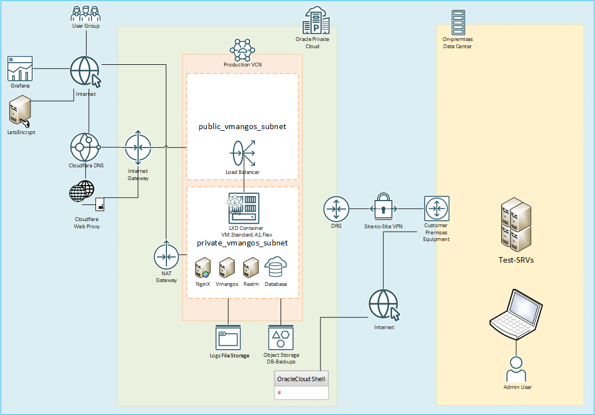

# Arquitectura de vMaNGOS en Oracle Cloud

## 🔧 Descripción general

Este repositorio documenta la infraestructura de un servidor vMaNGOS Classic (1.12.1) alojado en Oracle Cloud utilizando servicios gratuitos y buenas prácticas de seguridad.

## 🧱 Componentes principales

### 1. Cloudfare DNS y Web proxy
- Se realiza traducion de dominio realm1.wow-la.org hacia la IP publica del NLB, sin proxy
- Se realiza traducion de dominio www.wow-la.org hacia la IP publica del NLB, con proxy

### 2. Network Load Balancer
- Escucha en puertos 3724 TCP (realmd), 8085 TCP (mangosd), 443 WEB (HTTPS)
- Redirige tráfico a instancia backend sin IP pública, manteniendo la IPP de origen

### 3. Subredes
- **Pública**: Load balancer + Internet Gateway
- **Privada**: Nodo de aplicación + NAT Gateway

### 4. Nodo de aplicación (Compute)
- Instancia `VM.Standard.A1.Flex` sin IP pública
- Sistema operativo: Ubuntu 22.04
- Corre `LXD` como sistema de contenedores ligeros
- Shape configuration
  `OCPU count`: 4
  `Network bandwidth (Gbps)`: 4
  `Memory (GB)`: 24
  `Local disk (GB)`: 200, Block storage only

### 5. Contenedores LXC
- `realmd`: Servidor de autenticación
- `mangosd`: Servidor del mundo (game server)
- `mysql`: Base de datos MariaDB con acceso local
- `nginx`: Motor web server

## 🔄 Flujo de red

1. El usuario se conecta a través del NLB al contenedor `realmd`.
2. Una vez autenticado, se conecta al `mangosd` (puerto 8085, tambien via el NLB).
3. Los contenedores acceden a Internet y a los usuarios mediante el NAT Gateway (por actualizaciones o dependencias externas).

## 🔐 Seguridad
- No se exponen IPs públicas dentro del nodo de computo, la IP publica esta en el NLB y NATGW, por lo que se hereda protecciones de estos servicios de oracle.
- Acceso al computo solo desde la consola Cloud Shell via Internet, y directamente a la VCN desde la red on premises mediate una VPN de sitio a sitio
- Firewalls estrictos configurados en VCN y LXD

## 📊 Diagrama

## 📊 Estado del servidor (snapshot)

